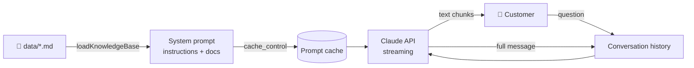

<div align="center">


<br/>

[](https://docs.anthropic.com)
[](https://www.typescriptlang.org/)
[](https://nodejs.org/)
[](LICENSE)


<br/>

**Drop your FAQs, price list and policies into a folder. Get a support agent that answers customers 24/7, in their own language, and never makes things up.**

</div>

---

## 🎬 Demo

<!-- Replace with a real GIF: record the terminal with `vhs` or QuickTime, save as docs/demo.gif -->
<!--  -->

```
You: Friday ko clinic kitne baje khulta hai?
Bot: Friday ko clinic do slots mein khulta hai:

     10:00 AM se 12:30 PM  (Jumma se pehle)
     3:00 PM  se 8:00 PM   (Jumma ke baad)

     Kya aap appointment book karna chahte hain?

You: How much does a root canal cost and does it hurt?
Bot: Root canal treatment is 18,000 to 25,000 PKR per tooth, done over
     2 visits of about 60 minutes each.

     It's done under local anesthesia so you shouldn't feel pain during
     the procedure. Mild soreness for 2 to 3 days afterwards is normal.

You: What's your refund policy?
Bot: I don't have information about a refund policy. Please call
     021-3456-7890 or WhatsApp 0300-1234567 and our staff will help.
```

> The demo knowledge base is a fictional dental clinic in Karachi. Swap the files in `data/` and it becomes your client's assistant.

---

## ✨ Features

| | Feature | What it means for the business |
|---|---|---|
| 🎯 | **Grounded answers** | Replies only from the documents you provide. Unknown question? It gives the phone number instead of guessing. |
| 🌍 | **Language matching** | Customer writes in English, Urdu, or Roman Urdu, bot replies in the same language and script. |
| 📅 | **Booking flow** | Collects name, phone, preferred time and service, then confirms the details back. |
| ⚡ | **Streaming** | Words appear as they are generated, no waiting for the full reply. |
| 💾 | **Prompt caching** | The knowledge base is cached on Anthropic's side, cutting input cost by up to 90% on repeat requests. |
| 🔁 | **Model switch in one line** | Haiku for cost, Sonnet or Opus for quality. The code adapts request parameters per model. |
| 🧪 | **Debug mode** | `DEBUG=1` prints token usage and cache hits after every reply. |

---

## 🏗️ How it works



1. **`src/knowledge.ts`** reads every `.md` / `.txt` in `data/` and wraps each in a `<document>` tag.
2. **`src/chat.ts`** builds a two-block system prompt. The large knowledge-base block carries `cache_control`, so it is cached after the first request.
3. **`src/index.ts`** runs the terminal chat loop. The API is stateless, so the full history is sent each turn.

---

## 🚀 Quick start

```bash
git clone <this-repo>
cd business-knowledge-assistant
npm install
cp .env.example .env     # paste your Anthropic API key
npm start
```

Requires **Node.js 22.6+**. TypeScript runs natively, there is no build step.

Want to see token usage and cache hits?

```bash
DEBUG=1 npm start
```

---

## 🛠️ Adapt it to a client

| Step | Where |
|---|---|
| Replace the documents | `data/` folder (any `.md` or `.txt`) |
| Change the business name | `BUSINESS_NAME` in `src/index.ts` |
| Adjust tone and booking rules | `buildSystemPrompt()` in `src/chat.ts` |
| Pick a model | `MODEL` in `src/chat.ts` |

### Model cost guide

| Model | Input / Output (per 1M tokens) | Best for |
|---|---|---|
| `claude-haiku-4-5` | $1 / $5 | FAQ bots, high volume, lowest cost **(default)** |
| `claude-sonnet-5-5` | $2 / $10 | Smarter replies, caches from 512 tokens |
| `claude-opus-5-5` | $4 / $20 | Highest quality |

A typical reply on Haiku costs around **$0.002**. One thousand customer questions is roughly **$2**.

---

## 🗺️ Roadmap

- [x] Terminal chat with streaming and history
- [x] Grounded answers with prompt caching
- [x] English / Urdu / Roman Urdu
- [ ] 🌐 Web chat widget (embed on any site)
- [ ] 💬 WhatsApp integration
- [ ] 🔍 Embeddings + vector search for 100+ page knowledge bases
- [ ] 📆 Booking tool that writes to Google Calendar

---

## 🤝 Want one for your business?

This project is the foundation I use to build custom support assistants for clinics, agencies, shops and service businesses. If you want one trained on your own documents and connected to your website or WhatsApp, open an issue or reach out.

<div align="center">

Built with the [Claude API](https://docs.anthropic.com) · Licensed under [MIT](LICENSE)

</div>
